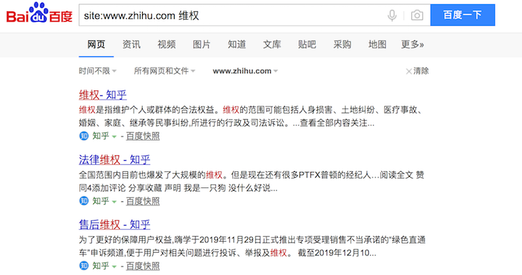
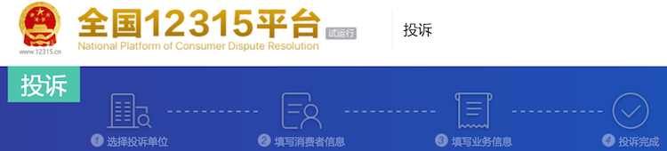
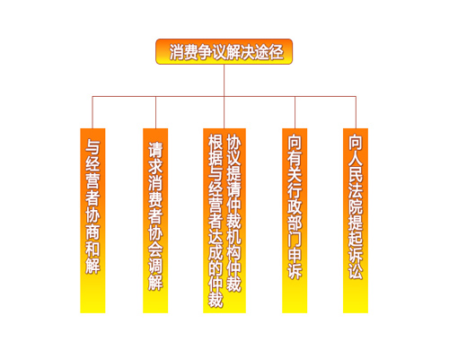
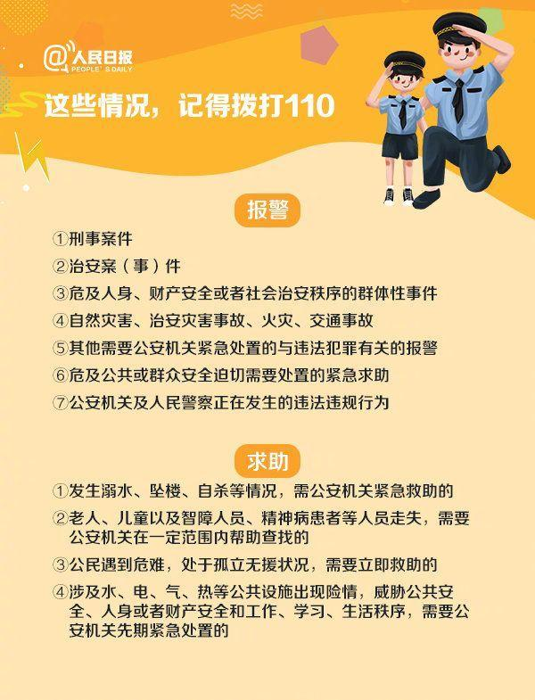
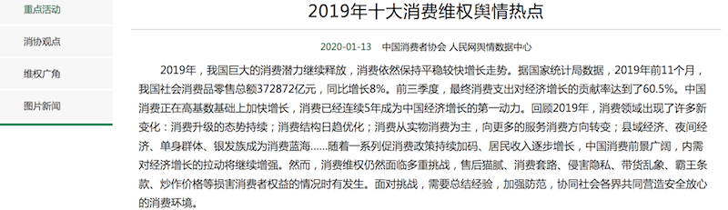

### 巧用互联网技术，进行消费者维权

原创作者：于立

#### 更多的精彩内容，请移步公众号“于立为文”，查看最新同名文章。

### 目录

[一、推荐的互联网技术](#1)

[技巧1、搜索引擎技术](#1-1)

[技巧2、求助专门网站](#1-2)

[技巧3、图片、声音等处理技巧](#1-3)

[技巧4、关注维权开源项目](#1-4)

[二、消费者法律与维权](#2)

[1. 法律法规](#2-1) ： [《消费者权益保护法》](#2-1-1)、[《电子商务法》](#2-1-2)、[《广告法》](#2-1-3) 等

[2. 选择维权](#2-2) ： [维权常识](#2-2-1)、[维权事件](#2-2-2)

[三、消费者维权词汇](#3)

---

### 一、推荐的互联网技术

#### 技巧1、搜索引擎技术

搜索引擎从互联网上搜集信息，在对信息进行组织和处理后，可以为用户提供信息检索服务。使用搜索引擎可以掌握骗术、维权等常识，以及获取企业信息、维权通道等可用信息。

针对百度、Google等常用浏览器的一些搜索技巧：

- 给出的搜索条件越具体，返回的结果就会越精确。

- 使用元词检索，告诉搜索引擎想要检索的内容具有哪些明确的特征：

    用 “title（或intitle）:搜索内容” 来搜索标题，用 “image:图片链接” 来搜索图片；用 “site:网站域名” 来搜索网站。

    把搜索范围限定在特定站点中，在查询内容的后面，加上 “site:网站域名” ，如 “site:www.zhihu.com 维权” 可以在知乎中找到维权的帖子。

    对搜索结果的url做某种限定， “inurl:” 后跟需要出现的关键词，如 “photoshop inurl:技巧” 可以找到关于 photoshop 的使用技巧。

#### 技巧2、求助专门网站

网站是用于展示特定内容网页的集合，我们可以通过网页浏览器来访问，使用电脑、手机或其他终端设备均可。求助专门网站，以及相关的APP、公众号、小程序等，可以随时了解信息、跟进维权。

下面列举一些相关的网站（还可以下载或关注同名的APP、公众号、小程序等）：

[中国消费者权益保护网](http://www.315.gov.cn)

[全国12315平台](http://www.12315.cn) - 由工商总局建设、全国工商和市场监管部门共同使用，是全国消费者通过电脑、手机、微信等多渠道、24小时便捷高效地进行投诉、举报的平台。

[防骗大数据](https://xueqiu.com/u/5492755690) - 每天推送各类骗局揭秘曝光、传销诈骗、金融诈骗、生活骗局、防骗支招、科普防骗知识。

[腾讯110](https://110.qq.com) - 集帐号安全、支付安全、有害行为打击为一体，提供QQ/微信的冻结、解冻、帐号申诉、违规行为举报、恶意线索查询、诈骗手法解析等综合安全服务。

[法信](http://www.faxin.cn) - 一个法律仓库，可以在线搜索国内的各种法律。

[消费日报网](http://www.xfrb.com.cn)

[法制时报数字报](http://fzsb.hinews.cn)

#### 技巧3、图片、声音等处理技巧

掌握图片、声音等处理技巧，可以保护隐私、提供证据、宣传骗局。为了方便正当的维权，需要在日常生活中培养必要的取证习惯，比如现场拍照、电话录音等，另外还需要对原始材料进行隐私处理。

##### 处理图片

使用手机自带图片编辑器、Adobe Photoshop(简称“PS”)、QQ截图、浏览器截图等图片处理工具，对图片进行马赛克、模糊处理、合并截取等操作。

##### 处理声音

使用Adobe Audition、GoldWave、ProTools、Cakewalk Sonar等声音后期处理工具，对声音进行剪切、合并截取、变声、加速、转换格式等操作。

#### 技巧4、关注维权开源项目

关注一些公众维权开源项目，可以抛出你的问题让专业人员负责技术落地。这里推荐的一个完全免费开源的项目： [消费者维权开源项目](https://github.com/shxingzhe/Public-Rights) 。

该项目旨在**宣传防骗常识、让更多的人远离骗局，主要特色是使用互联网技术将骗术“挖掘”到底，进而无限地接近实现“天下无贼”的终极目的。**

该项目坚持三个“**永不设限**”原则：

- 项目开放时间，永不设限；

- 爱心人士、公益组织、开源项目对骗局骗术的揭露和宣传，永不设限；

- 揭露的骗局类型和宣传方式，永不设限。

该项目搜集了详尽的多方面资料，包括互联网技术、法律常识、维权事件、相关词汇、相关资源链接、相关书籍等等，这将会极大地提升公众的事情处理能力。

---

### 二、消费者法律与维权

#### 1. 法律法规

我国有关保护消费者权益的法律有《消费者权益保护法》、《合同法》、《物权法》、《民法通则》、《侵权法》、《商标法》、《广告法》、《电子商务法》、《产品质量法》、《标准化法》、《进出口商品检验法》、《食品卫生法》、《药品管理法》、《反不正当竞争法》、《价格法》、《计量法》等。

下面摘录了部分法律规范，敬请消费者参阅和学习：

① [《消费者权益保护法》](http://www.315.gov.cn/zcfg/gjfl/201503/t20150309_152728.html)：

-  第六条 **保护消费者的合法权益是全社会的共同责任。**

    国家鼓励、支持一切组织和个人对损害消费者合法权益的行为进行社会监督。大众传播媒介应当做好维护消费者合法权益的宣传，对损害消费者合法权益的行为进行舆论监督。

- 第七条 消费者在购买、使用商品和接受服务时享有**人身、财产安全不受损害**的权利。消费者有权要求经营者提供的商品和服务，符合保障人身、财产安全的要求。

- 第八条 消费者享有**知悉其购买、使用的商品或者接受的服务的真实情况**的权利。

- 第九条 消费者享有**自主选择商品或者服务**的权利。

- 第十条 消费者享有**公平交易**的权利。消费者在购买商品或者接受服务时，有权获得质量保障、价格合理、计量正确等公平交易条件，有权拒绝经营者的强制交易行为。

- 第十一条 消费者因购买、使用商品或者接受服务受到人身、财产损害的，享有**依法获得赔偿**的权利。

- 第十四条 消费者在购买、使用商品和接受服务时，享有人格尊严、民族风俗习惯得到尊重的权利，享有**个人信息依法得到保护**的权利。

- 第二十条 经营者向消费者提供有关商品或者服务的质量、性能、用途、有效期限等信息，应当真实、全面，不得作虚假或者引人误解的宣传。

    经营者对消费者就其提供的商品或者服务的质量和使用方法等问题提出的询问，应当作出真实、明确的答复。

    经营者提供商品或者服务应当明码标价。

- 第二十二条 经营者提供商品或者服务，应当按照国家有关规定或者商业惯例向消费者出具发票等购货凭证或者服务单据；消费者索要发票等购货凭证或者服务单据的，经营者必须出具。

- 第四十五条 消费者因经营者利用虚假广告或者其他虚假宣传方式提供商品或者服务，其合法权益受到损害的，可以向经营者要求赔偿。广告经营者、发布者发布虚假广告的，消费者可以请求行政主管部门予以惩处。广告经营者、发布者不能提供经营者的真实名称、地址和有效联系方式的，应当承担赔偿责任。

- 第四十六条 消费者向有关行政部门投诉的，该部门应当自收到投诉之日起七个工作日内，予以处理并告知消费者。

② [《电子商务法》](http://www.npc.gov.cn/zgrdw/npc/lfzt/rlyw/2018-08/31/content_2060827.htm)：

- 第十七条　电子商务经营者应当全面、真实、准确、及时地披露商品或者服务信息，保障消费者的知情权和选择权。电子商务经营者不得以虚构交易、编造用户评价等方式进行虚假或者引人误解的商业宣传，欺骗、误导消费者。

- 第十八条　电子商务经营者根据消费者的兴趣爱好、消费习惯等特征向其提供商品或者服务的搜索结果的，应当同时向该消费者提供不针对其个人特征的选项，尊重和平等保护消费者合法权益。

- 第十九条　电子商务经营者搭售商品或者服务，应当以显著方式提请消费者注意，不得将搭售商品或者服务作为默认同意的选项。

- 第二十一条　电子商务经营者按照约定向消费者收取押金的，应当明示押金退还的方式、程序，不得对押金退还设置不合理条件。消费者申请退还押金，符合押金退还条件的，电子商务经营者应当及时退还。

- 第二十三条　电子商务经营者收集、使用其用户的个人信息，应当遵守法律、行政法规有关个人信息保护的规定。

- 第三十一条　电子商务平台经营者应当记录、保存平台上发布的商品和服务信息、交易信息，并确保信息的完整性、保密性、可用性。商品和服务信息、交易信息保存时间自交易完成之日起不少于三年；法律、行政法规另有规定的，依照其规定。

- 第三十五条　电子商务平台经营者不得利用服务协议、交易规则以及技术等手段，对平台内经营者在平台内的交易、交易价格以及与其他经营者的交易等进行不合理限制或者附加不合理条件，或者向平台内经营者收取不合理费用。

③ [《广告法》](http://www.npc.gov.cn/npc/c12435/201811/c10c8b8f625c4a6ea2739e3f20191e32.shtml) 广告内容准则：

- 第八条　广告中对商品的性能、功能、产地、用途、质量、成分、价格、生产者、有效期限、允诺等或者对服务的内容、提供者、形式、质量、价格、允诺等有表示的，应当准确、清楚、明白。

- 第十一条 广告使用数据、统计资料、调查结果、文摘、引用语等引证内容的，应当真实、准确，并表明出处。引证内容有适用范围和有效期限的，应当明确表示。

- 第十四条　广告应当具有可识别性，能够使消费者辨明其为广告。

- 第十七条　除医疗、药品、医疗器械广告外，禁止其他任何广告涉及疾病治疗功能，并不得使用医疗用语或者易使推销的商品与药品、医疗器械相混淆的用语。

- 第十九条　广播电台、电视台、报刊音像出版单位、互联网信息服务提供者不得以介绍健康、养生知识等形式变相发布医疗、药品、医疗器械、保健食品广告。

#### 2. 选择维权

##### 维权常识

防骗“四不”：不轻信、不理睬、不转账、不汇款。

消费者和经营者发生消费者权益争议的，可以通过下列途径解决：

感觉遇到危险时，请打给110；在特殊情况下，还可以通过短信12110，微信公众号、APP、直播互动等多种形式报警。

##### 维权事件

参考中消协近三年的消费维权舆情热点，以及社会流行和作者经历的维权事件，下面进行一些典型案例的整理：

① [理发除螨骗局事件](https://mp.weixin.qq.com/s/7nJw9wJiKS_xj_aw5z-gDw)

本文介绍了作者遭遇理发除螨骗局事件的始末，并且整理了多年来此类骗局的特征，分析了受害者和旁观者的微妙心理，也深入地剖析了人性的复杂，呼吁大家尽举手之劳让世界多一点爱。

② [奔驰车主哭诉维权](http://www.sohu.com/a/308255153_100040985)

陕西西安王女士花66万元买了一辆奔驰汽车，可车还没开出门就发现发动机漏油。随后尽管与4S店多次沟通，最终却被告知无法退款也不能换车，只能更换发动机。于是，这位女车主便坐在汽车引擎盖上“哭诉维权”。

③ [培训机构跑路学员退费无门](https://new.qq.com/rain/a/20191104A0MKW8)

某大型英语培训机构在国内主要城市的分店关门，受影响学员上万人。尤为引人注目的是，大量学员被培训机构诱导，从金融机构申请了人均数万元的培训贷。大批门店的关闭导致学员们无学可上，却还要继续还贷款。

④ [顺风车安全事件](https://new.qq.com/omn/20180827/20180827G0DSBV.html)

2018年，相继发生“郑州空姐滴滴顺风车遇害案”和“乐清女孩滴滴顺风车遇害案”，滴滴出行及其旗下的顺风车业务因此被推上舆论的风口浪尖，其运营理念与管理方式遭到舆论的诟病。

⑤ [共享出行押金难退](http://www.sznews.com/news/content/2019-03/13/content_21465484.htm)

2018年，共享汽车Togo途歌、共享电单车享骑、共享单车ofo先后爆出挪用押金、企业倒闭、退款难等问题。其中，押金难退再度成为共享经济的投诉热点。

⑥ [老年保健品骗局](https://www.sohu.com/a/142091470_653431)

继315央视曝光武汉乐百龄等公司向老人出售无资质保健品后，常年以捏造出的各种“专家”身份在广告中大肆吹捧产品作用的刘洪斌与胡祖秦等也被主流媒体集中报道，“老年人盲目购买产品”“虚假广告营销”“产品质量不过关”等负面曝光层出不穷。

⑦ [“校园贷”陷阱](http://www.sohu.com/a/270308411_100114053)

校园贷始于2014年，到2015年迎来爆发式增长，但因随后爆发的“裸贷、收费混乱、暴力催收”等负面事件备受舆论质疑。典型如某网络平台推出“颜值贷”涉嫌踏入校园贷禁区、长沙一网络贷款平台对39名大学生提起诉讼等话题引起舆论高度关注。

⑧ [OTA平台捆绑销售](http://www.woshipm.com/it/3030217.html)

2017年，在线旅游成为消费投诉“重灾区”。“演员韩雪微博炮轰携程捆绑销售”和“携程时隔半年回复百亿级坑骗消费者”事件引起巨大反响，旅游平台捆绑销售问题引发消费者热议，成为社会舆论焦点。

在这里列出了更多的参考资料：

● [2019年十大消费维权舆情热点](http://www.cca.org.cn/zxsd/detail/29425.html)

● [2018年十大消费维权舆情热点](http://www.cca.org.cn/zxsd/detail/28364.html)

● [2017年十大消费维权舆情热点](http://www.cca.org.cn/zxsd/detail/27835.html)

● [2018年度消费维权典型案例](http://www.sohu.com/a/301294684_100229361)

---

### 三、消费者维权词汇

**智商税**：又称低智商税，是指由于在购物时缺乏判断能力，花了冤枉钱，这些冤枉钱就被认为是“交了智商税”。

**欺诈消费**：存在于消费领域的欺诈行为，是不法商人推销其产品和服务的一种低劣手段，目的是为了排挤竞争对手，抢占市场，从而攫取高额利润。对消费者而言，消费欺诈严重侵犯了其知情权和公平交易权，使消费者不能通过交易行为获得满意的产品和服务，损害了消费者的合法权益；对市场经济秩序而言，利用欺诈手段推销的产品和服务，往往品质低劣、价格便宜，不法经营者利用欺诈手段恶意抢占市场份额，扰乱了正常的经营秩序，造成了不正当竞争。

**315国际消费者权益日**：目的在于扩大消费者权益保护的宣传，使之在世界范围内得到重视，以促进各国和地区消费者组织之间的合作与交往，在国际范围内更好地保护消费者权益。

**广告语违禁词**：

与虚假有关 - 史无前例、前无古人、永久、万能、祖传、特效、无敌、纯天然、100%等。

与欺诈有关（严禁使用刺激消费词语） - 点击领奖、恭喜获奖、全民免单、点击有惊喜、点击获取、点击转身、点击试穿、点击翻转、领取奖品涉嫌诱导消费者秒杀、抢爆、再不抢就没了、不会更便宜了、错过就没机会了、万人疯抢、全民疯抢/抢购、卖/抢疯了等。

**Tony老师**：用来吐槽那些“集技术和才华于一身”的理发师，他们能将简单的洗剪吹说得天花乱坠，当然最后的目的都离不开诱导办卡。

